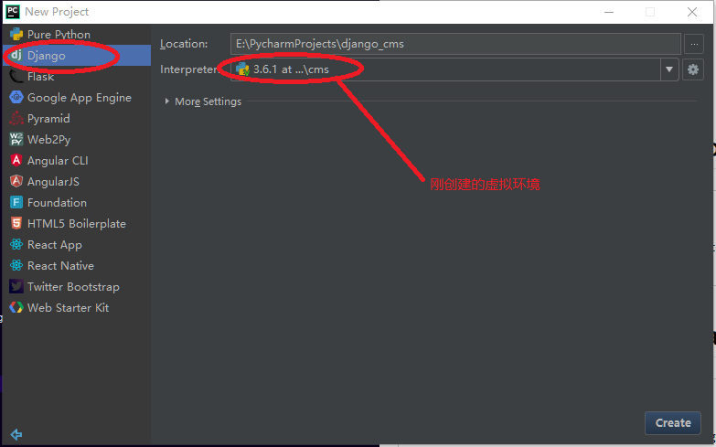
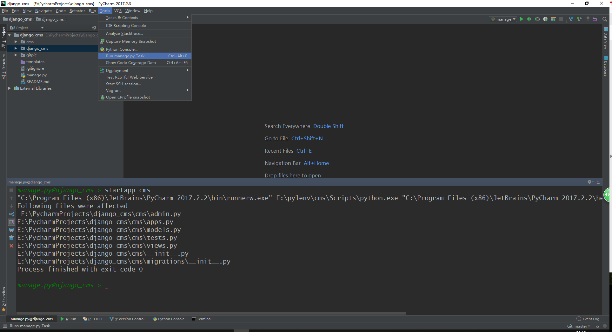

# django-cms 使用django搭建的内容管理系统
## Tools:
IDE: Pycharm
数据库：MySQL5.7 管理工具：SQLyog

操作系统：windows10
Python版本：3.6
django版本：1.11
版本管理工具: virtualenv

## 1、使用virtualenv搭建Python开发虚拟环境
```
E:\pylenv>virtualenv cms
Using base prefix 'e:\\anaconda3'
New python executable in E:\pylenv\cms\Scripts\python.exe
Installing setuptools, pip, wheel...done.
```
## 2、启动该虚拟环境并安装django
```
E:\pylenv\cms\Scripts>activate.bat

(cms) E:\pylenv\cms\Scripts>pip install django
Collecting django
  Downloading Django-1.11.7-py2.py3-none-any.whl (6.9MB)
    100% |████████████████████████████████| 7.0MB 11kB/s
Collecting pytz (from django)
  Using cached pytz-2017.3-py2.py3-none-any.whl
Installing collected packages: pytz, django
Successfully installed django-1.11.7 pytz-2017.3
若下载缓慢，可换安装源
(cms) E:\pylenv\cms\Scripts>pip install -i https://pypi.tuna.tsinghua.edu.cn/simple django
https://pypi.tuna.tsinghua.edu.cn/simple清华大学的pip源
```
## 3、使用Pycharm创建django项目

使用Tools-Run manage.py Task ——>输入`startapp cms`创建APP

在setting注册APP
```
INSTALLED_APPS = [
    'django.contrib.admin',
    'django.contrib.auth',
    'django.contrib.contenttypes',
    'django.contrib.sessions',
    'django.contrib.messages',
    'django.contrib.staticfiles',
    'cms',
]
```